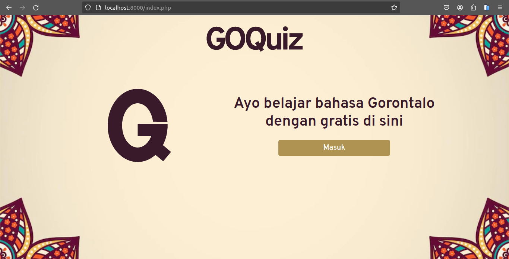

<p align="center">
  <picture>
    <source width="80" media="(prefers-color-scheme: dark)" srcset="img/logo-light.svg" />
    <source width="80" media="(prefers-color-scheme: light)" srcset="img/logo.svg" />
    
  </picture>
</p>

<h1 align="center">GOQuiz</h1>

<p align="center">
  This is a quiz game that tests your knowledge of the Gorontalo language.
  The game is a multiple choice quiz that will ask you a question and give you four options to choose from.
  If you choose the correct answer, you will be awarded a point.
  The game will end when you have answered all the questions.
  You can also view the high scores of other players.
</p>

## Technologies Used

- HTML
- CSS
- JavaScript
- Bootstrap
- PHP
- MySQL

## Installation

1. Clone the repository to your local machine using the following command:

```bash
# HTTPS
$ git clone https://github.com/fauzan-radji/goquiz.git

# SSH
$ git clone git@github.com:fauzan-radji/goquiz.git
```

2. Create a database named `goquiz` in your local machine.

3. Copy the `.env.example` file and rename it to `.env`. Then, fill in the `DB_HOST`, `DB_USER`, `DB_PASS`, and `DB_NAME` fields with your own database credentials.

```
DB_HOST=localhost
DB_USER=root
DB_PASS=
DB_NAME=goquiz
```

4. Import the `goquiz.sql` file into the `goquiz` database.

```bash
$ mysql -u <username> -p goquiz < goquiz.sql
```

4. Run the application using the following command:

```bash
$ php run serve
```

5. Open your browser and go to `localhost:8000`.

## Screenshots



Image 1: Home Screen


Image 2: Login Screen


Image 3: Register Screen


Image 4: Dashboard Screen


Image 5: Quiz Screen


Image 6: Result Screen

## Issues

If you encounter any issues or have suggestions, feel free to open an issue on the [Issue Tracker](https://github.com/fauzan-radji/goquiz/issues).
